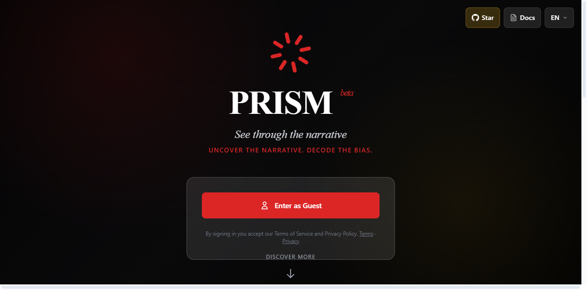
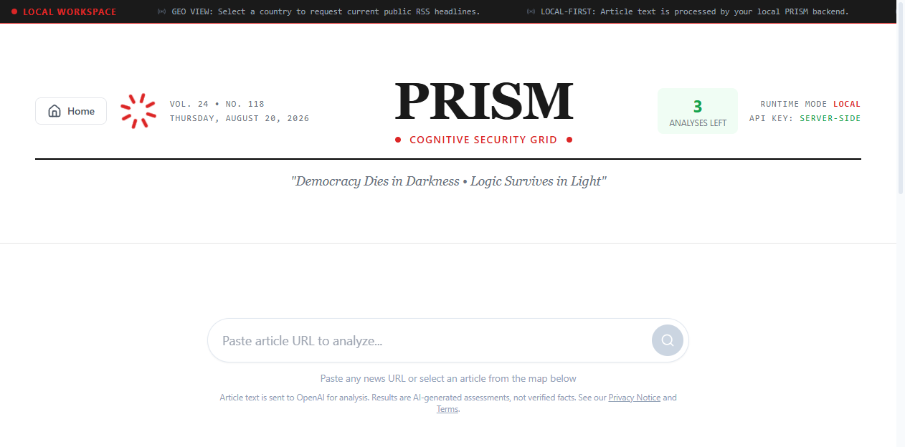

  

<h1 align="center">PRISM</h1>

  <strong>See through the narrative.</strong> 
  Local-first analysis of framing, rhetoric, omissions, and plausible narrative intent in public news.

  
  
  

PRISM is a local-first cognitive-security tool for examining the framing,
rhetorical devices, omitted context, and plausible narrative intent of public
news articles.

It is open-source software, not a hosted service. You run the interface and API
on your own machine and supply your own OpenAI API key. The output is an
AI-generated assessment—not a fact check, verified truth, or professional
advice.
> [!IMPORTANT]
> PRISM produces AI-generated assessments, not verified facts or professional
> advice. Read the original source and independently verify important claims.

## What it does

- accepts a public news article URL;
- extracts its text without executing article JavaScript;
- asks the configured OpenAI model for a structured narrative analysis;
- highlights framing, tone, stated facts, assumptions, and plausible intent;
- includes a geographic news view based on public RSS metadata;
- stores neither article bodies nor generated analyses.

## How it works

~~~mermaid
flowchart LR
    A["Public article URL"] --> B["FastAPI validation and rate limit"]
    B --> C["IP-pinned, bounded extraction"]
    C --> D["Your OpenAI API account"]
    D --> E["Schema-validated analysis"]
    E --> F["React workspace"]
~~~

The browser talks only to the local FastAPI process. Extraction and OpenAI
credentials remain server-side.

## Architecture

- **Frontend:** React 19, Vite, Tailwind CSS, and Framer Motion on port 5173.
- **Backend:** FastAPI on port 8001.
- **Analysis:** OpenAI Chat Completions using the key in the backend's local
  environment.
- **Extraction:** bounded HTTP(S) fetching with SSRF and DNS-rebinding defenses.
- **Abuse protection:** an in-memory limiter for local use, with optional Redis
  support for independently operated multi-instance installations.

The browser never receives the OpenAI key. The project has no hosted reference
instance, account system, analytics SDK, or project-operated proxy.

## Requirements

- Node.js 20.19 or newer (Node 22 LTS recommended)
- Python 3.14
- a personal OpenAI API key

## Quick start

Clone the repository:

~~~bash
git clone https://github.com/Daniele-Cangi/PRISM.git
cd PRISM
~~~

Create your private local configuration:

~~~powershell
Copy-Item .env.example .env
~~~

On macOS or Linux, use `cp .env.example .env`. Open `.env` and set:

~~~dotenv
OPENAI_API_KEY=your_personal_key_here
~~~

Never prefix the key with `VITE_`: variables with that prefix are embedded in
browser assets.

Install and start the backend:

~~~powershell
python -m venv .venv
.venv\Scripts\python.exe -m pip install -r requirements.txt
.venv\Scripts\python.exe server.py
~~~

On macOS or Linux, replace `.venv\Scripts\python.exe` with
`.venv/bin/python`.

In a second terminal, install and start the frontend:

~~~bash
npm ci
npm run dev
~~~

Open `http://localhost:5173`. The local API is available at
`http://localhost:8001`, with interactive documentation at
`http://localhost:8001/docs`.

The production frontend build is also local-backend aware:

~~~bash
npm run build
npm run preview
~~~

Set `VITE_API_URL` only when your own FastAPI process uses a different origin.

## Configuration

| Variable | Required locally | Purpose |
| --- | --- | --- |
| `OPENAI_API_KEY` | yes | personal server-side OpenAI credential |
| `OPENAI_MODEL` | no | model name; defaults to `gpt-4o` |
| `PORT` | no | FastAPI port; defaults to `8001` |
| `ALLOWED_ORIGINS` | no | exact browser origins; defaults to `http://localhost:5173` |
| `MAX_ANALYSES_PER_IP` | no | local rate limit; defaults to 3 |
| `RATE_LIMIT_WINDOW_SECONDS` | no | limiter window; defaults to 86400 seconds |
| `MAX_CONCURRENT_ANALYSES` | no | concurrent analysis cap; defaults to 2 |
| `RATE_LIMIT_REDIS_URL` | no | optional shared limiter for advanced self-hosting |
| `RATE_LIMIT_SALT` | no locally | HMAC secret required when `APP_ENV=production` |
| `TRUSTED_PROXY_HOPS` | no locally | trusted reverse-proxy hops; defaults to 0 |
| `VITE_API_URL` | no | custom backend origin for the frontend |

The included Dockerfile packages only the backend and remains optional:

~~~bash
docker build -t prism-api .
docker run --rm --env-file .env -p 8001:8001 prism-api
~~~

## Cost and data model

- PRISM is open-source and adds no subscription or paid discovery API.
- OpenAI API calls are billed directly to the account associated with the
  personal key.
- Extracted article text is sent to the configured OpenAI API.
- PRISM does not intentionally persist article bodies or generated analyses.
- The experimental v2 SQLite index stores discovery metadata only and is
  ignored by Git.

See [Privacy](PRIVACY.md) for the complete local data flow.

## Security model

Public URL processing is treated as hostile input:

- only HTTP on port 80 and HTTPS on port 443 are accepted;
- credentials, local hostnames, private IPs, metadata ranges, mixed public and
  private DNS answers, and non-global addresses are rejected;
- every redirect is resolved and validated again;
- connections are pinned to a validated public IP while preserving Host, TLS
  SNI, and certificate verification;
- response bodies are capped at 2 MB and extracted text at 25,000 characters;
- submitted URLs and raw IP addresses are excluded from application logs;
- request attempts are counted before external fetching or model inference.

If you expose your own instance publicly, also use an outbound firewall, exact
CORS origins, Redis-backed limiting, a random HMAC salt, and correctly configured
proxy trust.

## Validation

~~~bash
npm run check
npm audit --audit-level=high
python -m ruff format --check .
python -m ruff check .
python -m pytest -q --cov --cov-fail-under=60
python -m pip_audit -r requirements.txt
~~~

Python direct and transitive dependencies are pinned in `requirements.txt`
and `requirements-dev.txt`. Regenerate them from their corresponding `.in`
files with `pip-compile`.

## Responsible use

Submit only public article URLs that you are permitted to access and process.
The extracted text is sent to the OpenAI API account configured on your
machine. Do not submit private, confidential, personal, paywalled, infringing,
or unlawfully obtained material.

Read [Privacy](PRIVACY.md), [Terms](TERMS.md), [Security](SECURITY.md), and
[Contributing](CONTRIBUTING.md) before operating or contributing.

## License

PRISM is licensed under the [Apache License 2.0](LICENSE). Third-party
dependencies and content remain subject to their respective licenses.

## Experimental v2 acquisition

<strong>Free multi-source discovery architecture and benchmark</strong>

The isolated `acquisition_v2` package benchmarks multi-source event
acquisition without changing the public v1 API or invoking the analysis model.

The default discovery fabric has no paid API dependency. A query searches the
local SQLite/FTS metadata index first, then uses Google News as an experimental
free bootstrap sensor. Resolved direct URLs are written back to the local index:

~~~powershell
.venv\Scripts\python.exe -m acquisition_v2.runner `
  --query "event keywords" `
  --country IT
~~~

The index is stored at `.acquisition_v2/discovery-index.sqlite3`, which is
ignored by Git. Article bodies are never stored there. A later run can operate
only on accumulated metadata:

~~~powershell
.venv\Scripts\python.exe -m acquisition_v2.runner `
  --query "event keywords" `
  --source index
~~~

Google wrapper resolution uses an undocumented protocol and is enabled for the
spike with an explicit kill switch:

~~~powershell
.venv\Scripts\python.exe -m acquisition_v2.runner `
  --query "event keywords" `
  --no-resolve-google-wrappers
~~~

Operator-approved RSS feeds and explicit news sitemap `urlset` files can be
added to `acquisition_v2/source_registry.json`. The registry is intentionally
empty by default because publishers impose different reuse conditions. Example
entry:

~~~json
{
  "id": "publisher-world",
  "url": "https://publisher.example/world/rss.xml",
  "kind": "rss",
  "publisher": "Publisher",
  "language": "en",
  "country": "US",
  "poll_minutes": 60,
  "enabled": true
}
~~~

Use `"kind": "news_sitemap"` for an explicit news sitemap. Refreshes use
`ETag`/`Last-Modified`, bounded responses, per-source polling intervals and
exponential backoff:

~~~powershell
.venv\Scripts\python.exe -m acquisition_v2.runner `
  --query "event keywords" `
  --refresh-index
~~~

Only register feeds whose terms permit the intended use. GDELT and the paid
Brave adapter remain optional comparative providers and are never selected by
default.

The local report is written to `.acquisition_v2/latest-report.json`, which is
ignored by Git. A passing report requires at least 10 candidates, 8 useful
articles, 6 publishers and 4 probable independent lineage groups. Run the
benchmark across at least three representative events before proceeding to
claim extraction or UI work.

